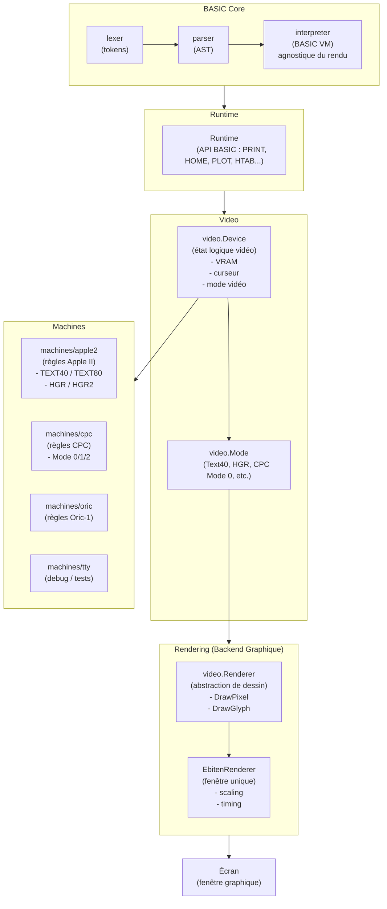

```mermaid

flowchart TB

    %% =====================
    %% BASIC CORE
    %% =====================
    subgraph BASIC_CORE["BASIC Core"]
        LEXER["lexer
        (tokens)"]
        PARSER["parser
        (AST)"]
        INTERPRETER["interpreter
        (BASIC VM)
        agnostique du rendu"]
    end

    LEXER --> PARSER
    PARSER --> INTERPRETER

    %% =====================
    %% RUNTIME
    %% =====================
    subgraph RUNTIME["Runtime"]
        RT["Runtime
        (API BASIC : PRINT, HOME, PLOT, HTAB...)"]
    end

    BASIC_CORE --> RUNTIME

    %% =====================
    %% VIDEO ABSTRACTION
    %% =====================
    subgraph VIDEO["Video"]
        DEVICE["video.Device
        (état logique vidéo)
        - VRAM
        - curseur
        - mode vidéo"]
        MODE["video.Mode
        (Text40, HGR, CPC Mode 0, etc.)"]
    end

    RUNTIME --> VIDEO
    DEVICE --> MODE

    %% =====================
    %% MACHINE ABSTRACTION
    %% =====================
    subgraph MACHINES["Machines"]
        APPLE2["machines/apple2
        (règles Apple II)
        - TEXT40 / TEXT80\n- HGR / HGR2"]
        CPC["machines/cpc
        (règles CPC)
        - Mode 0/1/2"]
        ORIC["machines/oric
        (règles Oric-1)"]
        TTY["machines/tty
        (debug / tests)"]
    end

    DEVICE --> MACHINES

    %% =====================
    %% RENDERING
    %% =====================
    subgraph RENDERING["Rendering (Backend Graphique)"]
        direction TB
        RENDERER["video.Renderer
        (abstraction de dessin)
        - DrawPixel
        - DrawGlyph"]
        EBITEN["EbitenRenderer
        (fenêtre unique)
        - scaling
        - timing"]
    end

    MODE --> RENDERING
    RENDERER --> EBITEN

    %% =====================
    %% OUTPUT
    %% =====================
    RENDERING --> SCREEN["Écran
    (fenêtre graphique)"]
```