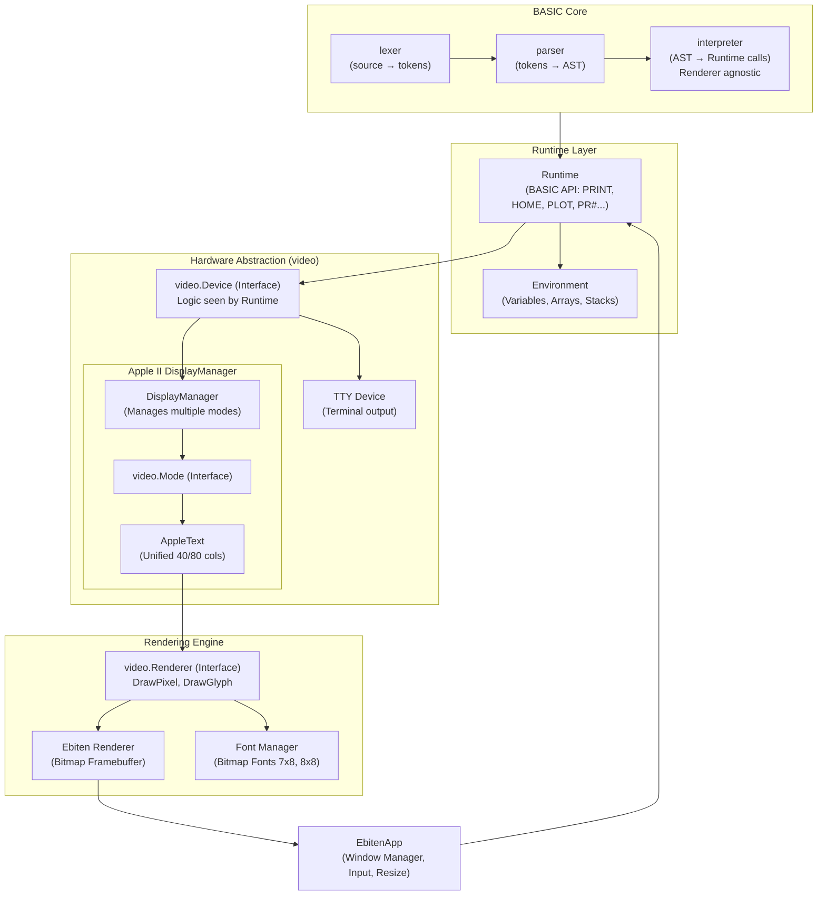

# Architecture "Basics"

## Overview

The project is a multi-BASIC, multi-architecture interpreter designed for retro computers (Apple II, C64, etc.). It uses a layered architecture to separate the BASIC language logic from the hardware-specific emulation and the graphical rendering.

## Component Diagram

## Key Architectural Concepts

### 1. DisplayManager & Multi-Mode Support
The `DisplayManager` (e.g., in `internal/machines/apple2`) acts as a proxy for the `video.Device` interface. It manages a collection of `video.Mode` instances (like `AppleText` or future `GR`/`HGR` modes).
- **Dynamic Switching**: The `SwitchMode(slot)` method (called via `PR#n`) allows the system to change the active mode at runtime.
- **Proxy Pattern**: All calls to the `video.Device` interface (Clear, Print, etc.) are delegated to the currently active `video.Mode`.

### 2. AppleText (Unified Text Mode)
Replacing the older `Text40` and `Text80` files, `AppleText` is a generic text mode implementation that:
- Uses `internal/video/text.TextMode` for buffer logic.
- Handles keyboard input (`INPUT`, `GET`) and blinking cursor logic.
- **Buffer Preservation**: Implements `CopyFrom(other)`, allowing content to be transferred when switching between 40 and 80 columns (or vice-versa), preserving the user's display.

### 3. Rendering Abstraction
The `video.Renderer` interface provides low-level primitives (`DrawPixel`, `DrawGlyph`). 
- **Ebiten Implementation**: The actual rendering is done via a bitmap framebuffer in `internal/video/ebiten`, which is then blitted to the screen.
- **Dynamic Resizing**: `EbitenApp` monitors the active mode's dimensions and automatically resizes the host window when a mode switch occurs (e.g., from 280px to 560px width).

### 4. Input Handling
Input is handled at the `EbitenApp` level and injected into the active `video.Device`. 
- **GET/INPUT Modes**: The device tracks whether it's waiting for a single key (`GET`) or a full line (`INPUT`).
- **Blink Cycle**: The `Update()` method in the device is called 60 times per second to handle internal state like cursor blinking.
